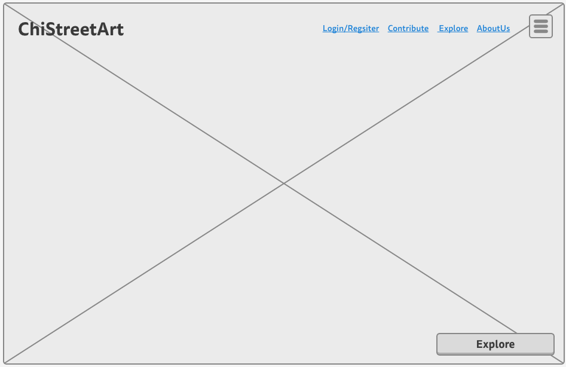
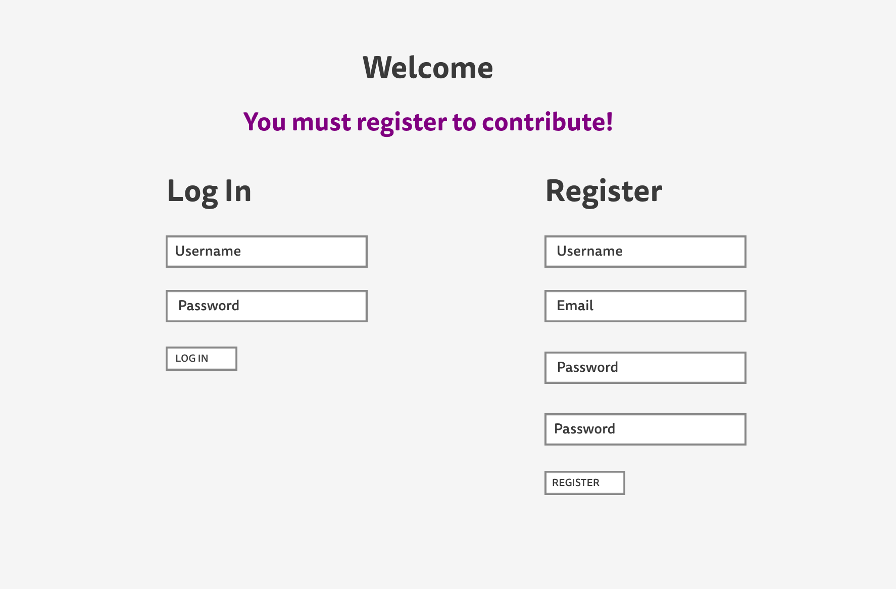
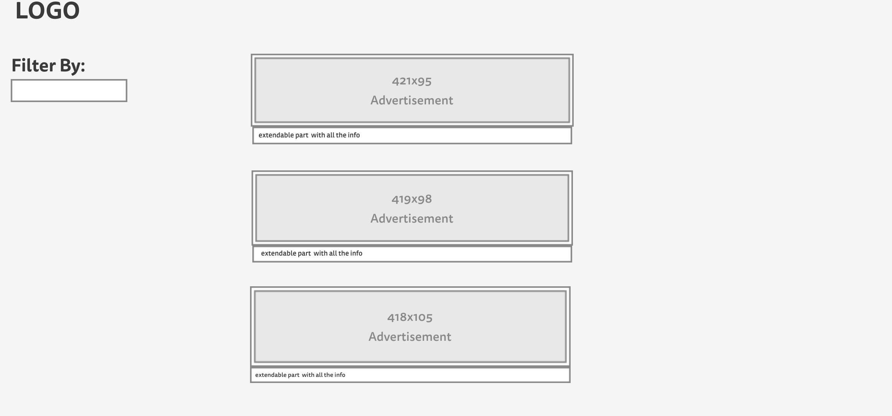

# ChiStreetArt

#### Contributors
- Josh English
- Alex Kim
- Armando Robledo
- Natalia Larina

### Objective
Just like any other world class city, Chicago offers an amazing array of art that can be seen in a museum or on a brick wall. A ride up and down the L will only expose you to a fraction of the Chicago street art on display throughout the city.
 
 
This page is intended to lessen that gap. It is our hope to catalogue the history of installations and commissioned walls through crowd sourced entries, allowing you to follow the transition of these communal art spaces.
 
 
We can’t always be the eyes on the street and need your help to allow this project to function. We’d love to see what moves and inspires you. Send us your photos.
 

### Technologies Used
- HTML5
- CSS/LESS
- Javascript/jQuery
- BCrypt
- Node/Express.js/Handlebars
- MongoDB

### Approach Taken
We decided to create a catalog application that would store Chicago street art historically. We then mapped out our user locations & images ERD.  After which we decided use MongoDB for our API and User's table to help with the performance of the application and ease of use.  The front end was built using HTML, LESS and Javascript.  Node and Express was selected for both the FrontEnd server and API server.  This combination of technologies allowed us to create a great user experience while keeping performance in mind of querying multiple servers.

### Wireframes

 
 

 
 

### Installation Instructions
- No installation required.
- Application can be viewed on any browser via heroku.com.
- Linked provided above.

### Unsolved Problems/Not Enough Time
- Image carousel for each location
- Styling for images
- Automatic login post register
- Image resizing
- Better efficiency with the API server
- Better efficiency with Mlabs for the user database
- Adding components with a Javascript Framework.
- Creating a mobile application version.
